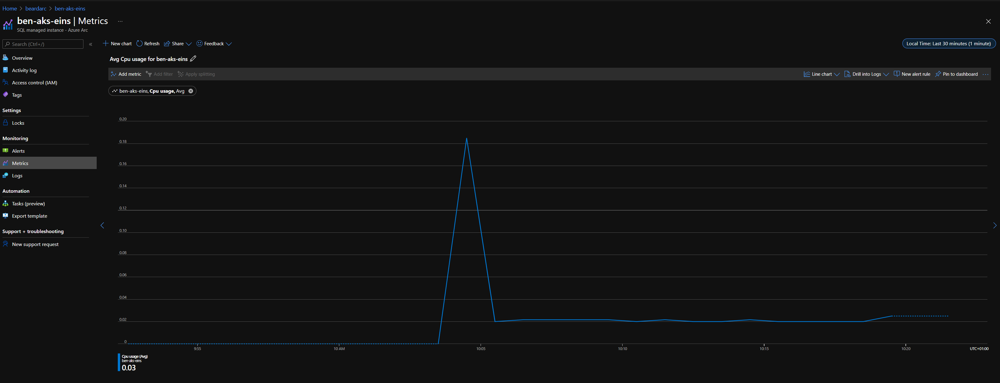

# Beard-Aks-AEDS

Setting up a AKS cluster and adding a Azure Arc Enabled Data Services Direct Data Controller using a jumpbox Azure VM

If you need a VM, you can 
- deploy the VM [deploy-vm.ps1](scripts/deploy-vm.ps1)
- and then login and set up the VM [set up vm.ps1](scripts/set-up-vm.ps1)

You will need to have these installed - You can use the set up VM script on your own machine.

- Azure Cli 
- kubectl 
- Azdata

To install all the componenets required using the scripts in the repo. You will need to alter the variables for your own environment.

- Create AKS [create-aks.ps1](scripts/create-aks.ps1)
- Deploy Log Analytics with bicep [Scripts/deploy-loganalytics.ps1](Scripts/deploy-loganalytics.ps1)
- Deploy the data controller with bicep [Scripts/deploy-dc.ps1](Scripts/deploy-dc.ps1)
- You can get the endpoints for the data controller
````
azdata login
azdata arc dc endpoint list
````
  

- Use the Cluster Management Service URL to connect to the data controlled in ADS with the Azure Arc Extension installed  
    

Then you can deploy SQL Managed Instances with bicep using [scripts/deploy-mi.ps1](scripts/deploy-mi.ps1) 

and view the resources in the portal

  
  
  
  
Right now, I cannot get the SQL Managed Instance endpoints using Azure Data Studio so you will need to go to the portal and get the external IP from the portal for the AKS cluster under Services and Ingresses. You need the one with the name MINAME-external-svc


Then you can use that IP and your admin username and password to connect. See below for more.


You can connect to grafana and see the metrics for the instances using the Metrics Dashboard endpoint from `azdata arc dc endpoint list` Use the Data Controller username and password. Click on Dashboards on the left and then manage and choose the dashboard to look at. There are dashboards for 

- Host Node Metrics
- Pods and Containers Metrics
- Postgres Metrics
- Postgres Table Metrics
- SQL Managed Instance Metrics


SQL Managed Instance Metrics


Host Node Metrics


Pods and Containers Metrics


You can view and search the logs in kibana using the Log Search Dashboard endpoint from `azdata arc dc endpoint list` Use the Data Controller username and password. Click the menu top left and choose discover to see the logs and then you can query or add filters to search them.


If you filter by pod name for SQLMIName-0 (or -1 or -2 if you have a 3 node replica) and the container name arc-sqlmi - You can see the SQL Server logs, which look like, well, SQL Server logs!!


In the portal you can see the metrics for the SQL Managed instance. CLick on the SQL Managed instance in the resource group and then metrics.



# Connecting to SQL

You can connect in Azure Data Studio just like you would any other SQL instance by clicking new connection top left in the connections tab. You will need the External IP of the service as described before.

You can then create a database with a `CREATE DATABASE` statement and watch it be created, backed up and added to the Availability Group in the container logs of the controller if you are like me!!


or in kibana by searching for the database name


