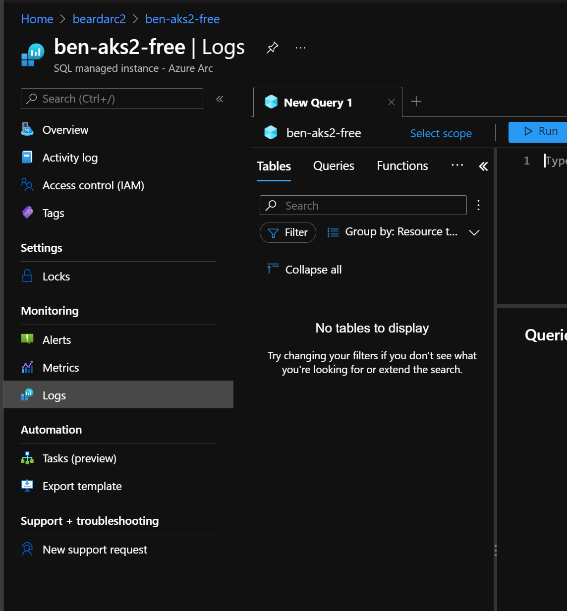

# Beard-Aks-AEDS

Setting up a AKS cluster and adding a Azure Arc Enabled Data Services Direct Data Controller using a jumpbox Azure VM

So I 
- deployed the VM [deploy-vm.ps1](deploy-vm.ps1)
- set up the VM [set up vm.ps1](set-up-vm.ps1)

or I ran from my machine - __both ways gave exactly the same results__ and
- Created AKS [create-aks.ps1](create-aks.ps1)
- Deployed the data controller from the portal
- got the endpoints  
    
- Connected to the data controlled in ADS in the jump box successfully  
    
- Deployed a single node manged instance from the portal
- Deployed a 3 node replica managed instance from the portal
- Deployed a single node manged instance using bicep [deploy-mi.ps1](deploy-mi.ps1) from my own machine because easy with secrets
- Deployed a 3 node replica managed instance using bicep [deploy-mi.ps1](deploy-mi.ps1) from my own machine because easy with secrets

  
  
  
  
When I try to connect back to the data controller in ADS (on the jump box)
  
  

If I try and reconnect 

  

Enabling debug logging in ADS and running again shows

````
4696 | 2021-06-27 08:36:49.0278 UTC | ERROR | cli.azdata.cli.core.output | {
  "code": 1,
  "logs": [],
  "stderr": "Sqlmi memory request must be at least '2Gi'",
  "stdout": []
}
````

which is what I get when I run

`azdata arc sql mi list`

or

`azdata arc sql endpoint list`

Going into the portal and getting the external IPs for the external service from AKS and I can connect to the instances


I can connect to grafana and see the instances


and I can connect to kibana


In the portal metrics are shown


Jump Box

````
PS C:\Users\benadmin> az version
{
  "azure-cli": "2.25.0",
  "azure-cli-core": "2.25.0",
  "azure-cli-telemetry": "1.0.6",
  "extensions": {
    "connectedk8s": "1.1.5",
    "customlocation": "0.1.2",
    "k8s-extension": "0.4.3"
  }
}

PS C:\Users\benadmin> azdata --version
20.3.5

Build (20210609.2)

SQL Server 2019 (15.0.4138)

Legal docs and information: https://aka.ms/eula-azdata-en

Python (Windows) 3.6.8 (tags/v3.6.8:3c6b436a57, Dec 24 2018, 00:16:47) [MSC v.1916 64 bit (AMD64)]

Python location 'C:\Program Files (x86)\Microsoft SDKs\Azdata\CLI\python.exe'


PS C:\Users\benadmin> azuredatastudio.cmd --version
1.30.0
59c4b8e90cf2d3a24bed72623197f10f8d090fdc
x64

````

My machine

````
 pwsh 7.1.3> az version
{
  "azure-cli": "2.25.0",
  "azure-cli-core": "2.25.0",    
  "azure-cli-telemetry": "1.0.6",
  "extensions": {
    "arcdata": "0.0.1",
    "connectedk8s": "1.1.5",     
    "customlocation": "0.1.2",   
    "k8s-extension": "0.4.3"     
  }
}


 pwsh 7.1.3> azdata --version
20.3.5

Build (20210609.2)

SQL Server 2019 (15.0.4138)

Legal docs and information: https://aka.ms/eula-azdata-en

Python (Windows) 3.6.8 (tags/v3.6.8:3c6b436a57, Dec 24 2018, 00:16:47) [MSC v.1916 64 bit (AMD64)]

Python location 'C:\Program Files (x86)\Microsoft SDKs\Azdata\CLI\python.exe'

 pwsh 7.1.3> azuredatastudio.cmd --version

1.30.0
59c4b8e90cf2d3a24bed72623197f10f8d090fdc
x64

````

and bicep deployment for data controller and SQL MI is now working also :-)


However, whilst metrics are uploaded

````
2021-06-28 11:05:42.7504 | INFO | [AzureUpload] ExportAndUpload starting...
2021-06-28 11:05:42.7504 | INFO | [AzureUpload] Looping through resources to upload...
2021-06-28 11:05:42.7504 | INFO | [AzureUpload] Trying to export metrics for ben-aks2-free...
2021-06-28 11:05:42.7683 | INFO | [AzureUpload] Got "CPU Usage" metric from ben-aks2-free.
2021-06-28 11:05:42.7833 | INFO | [AzureUpload] Start Logs ExportAndUpload at 20210628110342
2021-06-28 11:05:42.7833 | INFO | [AzureUpload] Got "Memory Usage" metric from ben-aks2-free.
2021-06-28 11:05:42.8049 | INFO | [AzureUpload] Got "Transactions/second" metric from ben-aks2-free.
2021-06-28 11:05:42.8049 | INFO | [AzureUpload] Metrics found for resource ben-aks2-free.
2021-06-28 11:05:42.8340 | INFO | [AzureUpload] Start retrieving last 15 minutes of logs for sqlmanagedinstance instance ben-aks2-free, this may take some time...
2021-06-28 11:05:42.8472 | INFO | QueryElasticSearch called with body: {"StartTime":"2021-06-28T10:48:42.7833185+00:00","EndTime":"2021-06-28T10:49:42.7833185+00:00","TermQueries":{"custom_resource_name.keyword":"ben-aks2-free","kubernetes_container_name.keyword":"arc-sqlmi","log_filename.keyword":"/var/opt/mssql/log/errorlog"},"RegexQueries":{}}
2021-06-28 11:05:42.9123 | INFO | [AzureUpload] Metric upload requestId: 677b5a58-2ab4-4f90-87f9-a6cc5605d088
2021-06-28 11:05:43.4192 | INFO | [AzureUpload] Metric upload response status: OK.
````


Logs are not

````
2021-06-28 11:05:44.6147 | INFO | QueryElasticSearch called with body: {"StartTime":"2021-06-28T11:02:42.7833185+00:00","EndTime":"2021-06-28T11:03:42.7833185+00:00","TermQueries":{"custom_resource_name.keyword":"ben-aks2-free","kubernetes_container_name.keyword":"arc-sqlmi","log_filename.keyword":"/var/opt/mssql/log/errorlog"},"RegexQueries":{}}
2021-06-28 11:05:44.6605 | INFO | [AzureUpload] Elastic Search returning 177 records.
2021-06-28 11:05:44.6605 | INFO | [AzureUpload] QueryElasticSearch add LogCollection with 177 records to responseList.
2021-06-28 11:05:44.6605 | INFO | Collected 1 logs from UTC 20210628104842 to 20210628110342
2021-06-28 11:05:44.6605 | INFO | [AzureUpload] Successfully exported logs to upload for sqlmanagedinstance instance ben-aks2-free
2021-06-28 11:05:44.6639 | INFO | [AzureUpload] Uploading 4 log payloads for instance ben-aks2-free
2021-06-28 11:05:44.6671 | INFO | [AzureUpload] Log upload request URI: https://cf3958a8-20e3-4422-8131-c762678d417d.ods.opinsights.azure.com/api/logs?api-version=2016-04-01
2021-06-28 11:05:44.9935 | INFO | [AzureUpload] Log upload response status: OK.
2021-06-28 11:05:44.9935 | INFO | [AzureUpload] Log upload request URI: https://cf3958a8-20e3-4422-8131-c762678d417d.ods.opinsights.azure.com/api/logs?api-version=2016-04-01
2021-06-28 11:05:45.0077 | INFO | [AzureUpload] Log upload response status: Forbidden.
2021-06-28 11:05:45.0077 | INFO | [AzureUpload] Log upload response failure msg: {"Error":"InvalidAuthorization","Message":"An invalid date format used in the x-ms-date header."}.
2021-06-28 11:05:45.0077 | ERROR | [PeriodicTask] 'Export and upload custom logs' task threw an exception: System.InvalidOperationException: Nullable object must have a value.
at System.Nullable`1.get_Value()
at Microsoft.SqlServer.Controller.AzureUpload.ResilienceHttpClient.HttpInvoker(Func`1 action, String operation) in /tmp/jenkins/workspace/Releases/arc/arc-public-preview-may2021/aris-arc-private-preview/aris/projects/controller/src/Microsoft.SqlServer.Controller/AzureUpload/ResilienceHttpClient.cs:line 57
at Microsoft.SqlServer.Controller.AzureUpload.LogResilienceHttpClient.PostAsyncWithRetry(String jsonBodyContent, Uri uri, String logType, String signature, String date, String resourceId) in /tmp/jenkins/workspace/Releases/arc/arc-public-preview-may2021/aris-arc-private-preview/aris/projects/controller/src/Microsoft.SqlServer.Controller/AzureUpload/Log/LogResilienceHttpClient.cs:line 31
at Microsoft.SqlServer.Controller.AzureUpload.LogUploader.UploadInstanceLogExport(InstanceLogExport instanceLogExport, String url) in /tmp/jenkins/workspace/Releases/arc/arc-public-preview-may2021/aris-arc-private-preview/aris/projects/controller/src/Microsoft.SqlServer.Controller/AzureUpload/Log/LogUploader.cs:line 99
at Microsoft.SqlServer.Controller.AzureUpload.LogUploader.ExportAndUpload() in /tmp/jenkins/workspace/Releases/arc/arc-public-preview-may2021/aris-arc-private-preview/aris/projects/controller/src/Microsoft.SqlServer.Controller/AzureUpload/Log/LogUploader.cs:line 73
at Microsoft.SqlServer.Controller.ControllerService.<>c.<StartBackgroundTasks>b__64_6() in /tmp/jenkins/workspace/Releases/arc/arc-public-preview-may2021/aris-arc-private-preview/aris/projects/controller/src/Microsoft.SqlServer.Controller/ControllerService.cs:line 1766
at Microsoft.SqlServer.Controller.Utils.PeriodicTask.RunAsync(String taskName, Action action, TimeSpan interval, CancellationToken cancellationToken) in /tmp/jenkins/workspace/Releases/arc/arc-public-preview-may2021/aris-arc-private-preview/aris/projects/controller/src/Microsoft.SqlServer.Controller/Utils/PeriodicTask.cs:line 49
2021-06-28 11:05:51.9397 | INFO | [HadrRoleManagerStateMachine: ben-aks2-free] Transitioning from 'HealthyWait' to 'Healthy' state.

````

