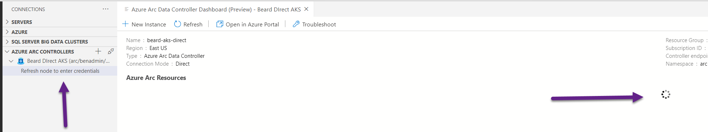

# Beard-Aks-AEDS

Setting up a AKS cluster and adding a Azure Arc Enabled Data Services Direct Data Controller using a jumpbox Azure VM

So I 
- deployed the VM [deploy-vm.ps1](deploy-vm.ps1)
- set up the VM [set up vm.ps1](set-up-vm.ps1)

or I ran from my machine and
- Created AKS [create-aks.ps1](create-aks.ps1)
- Deployed the data controller from the portal
- got the endpoints  
    
- Connected to the data controlled in ADS in the jump box successfully  
    
- Deployed a single node manged instance from the portal
- Deployed a 3 node replica managed instance from the portal
- Deployed a single node manged instance using bicep [deploy-mi.ps1](deploy-mi.ps1) from my own machine because easy with secrets
- Deployed a 3 node replica managed instance using bicep [deploy-mi.ps1](deploy-mi.ps1) from my own machine because easy with secrets

  
  
  
  
When I try to connect back to the data controller in ADS (on the jump box)
  
  

If I try and reconnect 

  

Enabling debug logging in ADS and running again shows

````
4696 | 2021-06-27 08:36:49.0278 UTC | ERROR | cli.azdata.cli.core.output | {
  "code": 1,
  "logs": [],
  "stderr": "Sqlmi memory request must be at least '2Gi'",
  "stdout": []
}
````

which is what I get when I run

`azdata arc sql mi list`

or

`azdata arc sql endpoint list`

Going into the portal and getting the external IPs for the external service from AKS and I can connect to the instances


I can connect to grafana and see the instances


although I can connect to it


In the portal metrics are shown


Jump Box

````
PS C:\Users\benadmin> az version
{
  "azure-cli": "2.25.0",
  "azure-cli-core": "2.25.0",
  "azure-cli-telemetry": "1.0.6",
  "extensions": {
    "connectedk8s": "1.1.5",
    "customlocation": "0.1.2",
    "k8s-extension": "0.4.3"
  }
}

PS C:\Users\benadmin> azdata --version
20.3.5

Build (20210609.2)

SQL Server 2019 (15.0.4138)

Legal docs and information: https://aka.ms/eula-azdata-en

Python (Windows) 3.6.8 (tags/v3.6.8:3c6b436a57, Dec 24 2018, 00:16:47) [MSC v.1916 64 bit (AMD64)]

Python location 'C:\Program Files (x86)\Microsoft SDKs\Azdata\CLI\python.exe'


PS C:\Users\benadmin> azuredatastudio.cmd --version
1.30.0
59c4b8e90cf2d3a24bed72623197f10f8d090fdc
x64

````

My machine

````
 pwsh 7.1.3> az version
{
  "azure-cli": "2.25.0",
  "azure-cli-core": "2.25.0",    
  "azure-cli-telemetry": "1.0.6",
  "extensions": {
    "arcdata": "0.0.1",
    "connectedk8s": "1.1.5",     
    "customlocation": "0.1.2",   
    "k8s-extension": "0.4.3"     
  }
}


 pwsh 7.1.3> azdata --version
20.3.5

Build (20210609.2)

SQL Server 2019 (15.0.4138)

Legal docs and information: https://aka.ms/eula-azdata-en

Python (Windows) 3.6.8 (tags/v3.6.8:3c6b436a57, Dec 24 2018, 00:16:47) [MSC v.1916 64 bit (AMD64)]

Python location 'C:\Program Files (x86)\Microsoft SDKs\Azdata\CLI\python.exe'

 pwsh 7.1.3> azuredatastudio.cmd --version

1.30.0
59c4b8e90cf2d3a24bed72623197f10f8d090fdc
x64

````

